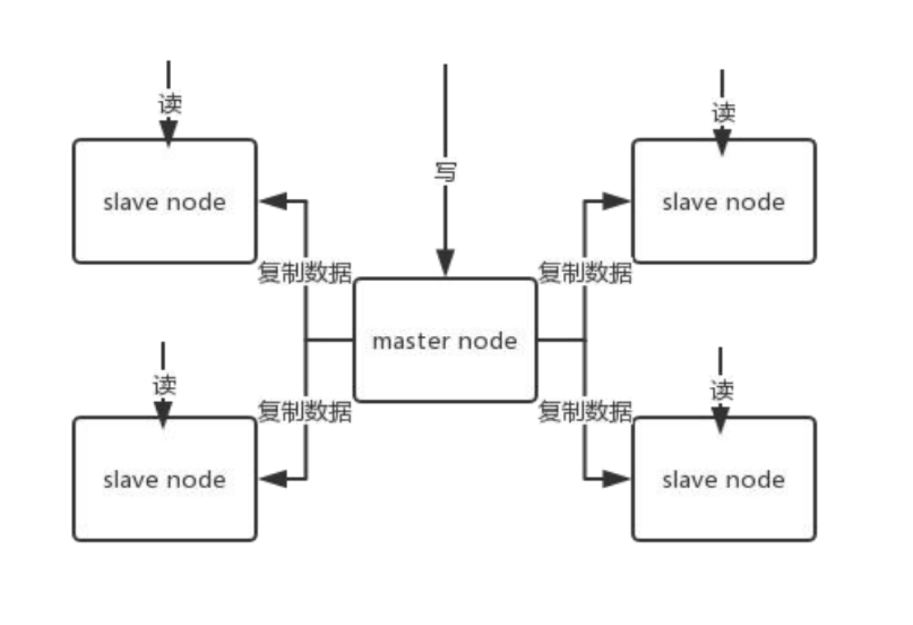

# redis架构：高并发、高可用
**1. redis为什么这么快？**
* 完全基于内存，绝大部分请求是纯粹的内存操作，非常快速。数据存在内存中，类似于HashMap，HashMap的优势就是查找和操作的时间复杂度都是O(1)；

* 数据结构简单，对数据操作也简单，Redis中的数据结构是专门进行设计的；

* 采用单线程，避免了不必要的上下文切换和竞争条件，也不存在多进程或者多线程导致的切换而消耗 CPU，不用去考虑各种锁的问题，不存在加锁释放锁操作，没有因为可能出现死锁而导致的性能消耗；

* 使用多路I/O复用模型，非阻塞IO；

* 使用底层模型不同，它们之间底层实现方式以及与客户端之间通信的应用协议不一样，Redis直接自己构建了VM 机制 ，因为一般的系统调用系统函数的话，会浪费一定的时间去移动和请求；
    > **多路 I/O 复用模型:**
    多路I/O复用模型是利用 select、poll、epoll 可以同时监察多个流的 I/O 事件的能力，在空闲的时候，会把当前线程阻塞掉，当有一个或多个流有 I/O 事件时，就从阻塞态中唤醒，于是程序就会轮询一遍所有的流（epoll 是只轮询那些真正发出了事件的流），并且只依次顺序的处理就绪的流，这种做法就避免了大量的无用操作。

**2. 你们生产环境中Redis架构是怎么样的**
1. 面试官心里分析

    看看你了解不了解你们公司的redis生产集群的部署架构，如果你不了解，那么确实你就很失职 了，你的redis是主从架构？集群架构？用了哪种集群方案？有没有做高可用保证？有没有开启  持久化机制确保可以进行数据恢复？线上redis给几个G的内存？设置了哪些参数？压测后你们    redis集群承载多少QPS？

2. 面试题剖析

    redis cluster，10台机器，5台机器部署了redis主实例，另外5台机器部署了redis的从实例，每个主实例挂了一个从实例，5个节点对外提供读写服务，每个节点的读写高峰qps可能可以达到每秒5万，5台机器最多是25万读写请求/s。

    机器是什么配置？32G内存+8核CPU+1T磁盘，但是分配给redis进程的是10g内存，一般线上生产环境，redis的内存尽量不要超过10g，超过10g可能会有问题。

    5台机器对外提供读写，一共有50g内存。

    因为每个主实例都挂了一个从实例，所以是高可用的，任何一个主实例宕机，都会自动故障迁移，redis从实例会自动变成主实例继续提供读写服务

    你往内存里写的是什么数据？每条数据的大小是多少？商品数据，每条数据是10kb。100条数据是1mb，10万条数据是1g。常驻内存的是200万条商品数据，占用内存是20g，仅仅不到总内存的50%。

    目前高峰期每秒就是3500左右的请求量

**3. 如何保证 redis 的高并发和高可用？redis 的主从复制原理能介绍一下么？redis 的哨兵原理能介绍一 下么？**
```
面试官心理分析:
其实问这个问题，主要是考考你，redis 单机能承载多高并发？如果单机扛不住如何扩容扛更多的并发？

redis 会不会挂？既然 redis 会挂那怎么保证 redis 是高可用的？

其实针对的都是项目中你肯定要考虑的一些问题，如果你没考虑过，那确实你对生产系统中的问题思考太少

```

***

### Redis 主从架构:
单机的 redis，能够承载的 QPS 大概就在上万到几万不等。对于缓存来说，一般都是用来支撑读高并发的。

因此架构做成主从(master-slave)架构，一主多从，主负责写，并且将数据复制到其它的 slave 节点，从节点负责读。所有的读请求全部走从节点。这样也可以很轻松实现水平扩容，支撑读高并发。

***
### redis replication 的核心机制
redis 采用异步方式复制数据到 slave 节点，不过 redis2.8 开始，slave node 会周期性地确认自己每次复制的数据量；

一个 master node 是可以配置多个 slave node 的；

slave node 也可以连接其他的 slave node；

slave node 在做复制的时候，也不会**阻塞**对自己的查询操作，它会用旧的数据集来提供服务；但是复制完成的时候，需要删除旧数据集，加载新数据集，这个时候就会暂停对外服务了；

slave node 主要用来进行横向扩容，做读写分离，扩容的 slave node 可以提高读的吞吐量。

如果采用了主从架构，那么建议必须开启 master node 的持久化，不建议用 slave node 作为master node 的数据热备，因为那样的话，如果你关掉 master 的持久化，可能在 master 宕机重启的时候数据是空的，然后可能一经过复制， slave node 的数据也丢了。

另外，master 的各种备份方案，也需要做。万一本地的所有文件丢失了，从备份中挑选一份 rdb 去恢复master，这样才能确保启动的时候，是有数据的，即使采用了后续讲解的高可用机制，slave node 可以自动接管 master node，但也可能 sentinel 还没检测到 master failure，master node 就自动重启了，还是可能导致上面所有的 slave node 数据被清空。

***
###redis 主从复制的核心原理
当启动一个 slave node 的时候，它会发送一个 PSYNC 命令给 master node。
如果这是 slave node 初次连接到 master node，那么会触发一次 full resynchronization 全量复制。
此时 master 会启动一个后台线程，开始生成一份 RDB 快照文件，同时还会将从客户端 client 新收到的所有写命令缓存在内存中。RDB 文件生成完毕后， master 会将这个 RDB 发送给 slave，slave 会先写入本地磁盘，然后再从本地磁盘加载到内存中，接着 master 会将内存中缓存的写命令发送到 slave，slave 也会同步这些数据。slave node 如果跟 master node 有网络故障，断开了连接，会自动重连，连接之后 master node 仅会复制给 slave 部分缺少的数据。


)

***
### 主从复制的断点续传
从 redis2.8 开始，就支持主从复制的断点续传，如果主从复制过程中，网络连接断掉了，那么可以接着上次复制的地方，继续复制下去，而不是从头开始复制一份。

master node 会在内存中维护一个 backlog，master 和 slave 都会保存一个 replica offset 还有一个master run id，offset 就是保存在 backlog 中的。如果 master 和 slave 网络连接断掉了，slave 会让 master 从上次 replica offset 开始继续复制，如果没有找到对应的 offset，那么就会执行一次 resynchronization。

如果根据 host+ip 定位 master node，是不靠谱的，如果 master node 重启或者数据出现了变化，那么 slave node 应该根据不同的 run id 区分。
***

### 无磁盘化复制
master 在内存中直接创建 RDB，然后发送给 slave，不会在自己本地落地磁盘了。只需要在**配置文件**中开启 repl-diskless-sync yes 即可。
```
repl-diskless-sync yes
# 等待 5s 后再开始复制，因为要等更多 slave 重新连接过来
repl-diskless-sync-delay 5
```

***
### 过期 key 处理
slave 不会过期 key，只会等待 master 过期 key。如果 master 过期了一个 key，或者通过 LRU 淘汰了一个 key，那么会模拟一条 del 命令发送给 slave。
***

### 复制的完整流程
slave node 启动时，会在自己本地保存 master node 的信息，包括 master node 的 host 和 ip，但是复制流程没开始。

slave node 内部有个定时任务，每秒检查是否有新的 master node 要连接和复制，如果发现，就跟 master node 建立 socket 网络连接。然后 slave node 发送 ping 命令给 master node。如果 master 设置了requirepass，那么 slave node 必须发送 masterauth 的口令过去进行认证。master node 第一次执行全量复制，将所有数据发给 slave node。而在后续，master node 持续将写命令，异步复制给 slave node。


***

### 全量复制
* master 执行 bgsave ，在本地生成一份 rdb 快照文件。

* master node 将 rdb 快照文件发送给 slave node，如果 rdb 复制时间超过 60 秒（repl-timeout），那么 slave node 就会认为复制失败，可以适当调大这个参数(对于千兆网卡的机器，一般每秒传输 100MB，6G 文件，很可能超过 60s)

* master node 在生成 rdb 时，会将所有新的写命令缓存在内存中，在 slave node 保存了 rdb 之后，再将新的写命令复制给 slave node。

* 如果在复制期间，内存缓冲区持续消耗超过 64MB，或者一次性超过 256MB，那么停止复制，复制失败。

    ```
    client-output-buffer-limit slave 256MB 64MB 60
    ```
* slave node 接收到 rdb 之后，清空自己的旧数据，然后重新加载 rdb 到自己的内存中，同时基于旧的数据版本对外提供服务。

* 如果 slave node 开启了 AOF，那么会立即执行 BGREWRITEAOF，重写 AOF。

***
### 增量复制
* 如果全量复制过程中，master-slave 网络连接断掉，那么 slave 重新连接 master 时，会触发增量复制。

* master 直接从自己的 backlog 中获取部分丢失的数据，发送给 slave node，默认 backlog 就是1MB。

* master 就是根据 slave 发送的 psync 中的 offset 来从 backlog 中获取数据的。
***
### heartbeat
主从节点互相都会发送 heartbeat 信息。

master 默认每隔 10 秒 发送一次 heartbeat，slave node 每隔 1 秒 发送一个 heartbeat。

## 异步复制
master 每次接收到写命令之后，先在内部写入数据，然后异步发送给 slave node。
***

### redis 如何才能做到高可用
如果系统在 365 天内，有 99.99% 的时间，都是可以哗哗对外提供服务的，那么就说系统是高可用的。

一个 slave 挂掉了，是不会影响可用性的，还有其它的 slave 在提供相同数据下的相同的对外的查询服务。

但是，如果 master node 死掉了，会怎么样？没法写数据了，写缓存的时候，全部失效了。slave node 还有什么用呢，没有 master 给它们复制数据了，系统相当于不可用了。

redis 的高可用架构，叫做 failover 故障转移，也可以叫做主备切换。

master node 在故障时，自动检测，并且将某个 slave node 自动切换为 master node 的过程，叫做主备切换。这个过程，实现了 redis 的主从架构下的高可用。

#### 哨兵的介绍：
sentinel，中文名是哨兵。哨兵是 redis 集群机构中非常重要的一个组件，主要有以下功能：
> 集群监控：负责监控 redis master 和 slave 进程是否正常工作。
> 消息通知：如果某个 redis 实例有故障，那么哨兵负责发送消息作为报警通知给管理员。
> 故障转移：如果 master node 挂掉了，会自动转移到 slave node 上。
> 配置中心：如果故障转移发生了，通知 client 客户端新的 master 地址。

哨兵用于实现 redis 集群的高可用，本身也是分布式的，作为一个哨兵集群去运行，互相协同工作。
故障转移时，判断一个 master node 是否宕机了，需要大部分的哨兵都同意才行，涉及到了分布式选举的问题。
即使部分哨兵节点挂掉了，哨兵集群还是能正常工作的，因为如果一个作为高可用机制重要组成部分的故障转移系统本身是单点的，那就很坑爹了。

***
# redis: 雪崩、穿透、预热、降级
## 一、 缓存雪崩
缓存雪崩我们可以简单的理解为：**由于原有缓存失效，新缓存未到期间**(例如：我们设置缓存时采用了相同的过期时间，在同一时刻出现大面积的缓存过期)，所有原本应该访问缓存的请求都去查询数据库了，而对数据库CPU和内存造成巨大压力，严重的会造成数据库宕机。从而形成一系列连锁反应，造成整个系统崩溃。

缓存正常从Redis中获取，示意图如下：

缓存失效瞬间示意图，如下：


> 缓存失效时的雪崩效应对底层系统的冲击非常可怕！
大多数系统设计者考虑用**加锁或者队列**的方式保证来保证不会有大量的线程对数据库一次性进行读写，从而避免失效时大量的并发请求落到底层存储系统上。
还有一个简单方案就是**缓存失效时间分散开**，比如我们可以在原有的失效时间基础上增加一个随机值，比如1-5分钟随机，这样每一个缓存的过期时间的重复率就会降低，就很难引发集体失效的事件。
对于“**Redis挂掉了，请求全部走数据库**”这种情况，我们可以有以下的思路：
**事发前**：实现Redis的高可用(主从架构+Sentinel（哨兵） 或者Redis Cluster（集群）)，尽量避免Redis挂掉这种情况发生。
**事发中**：万一Redis真的挂了，我们可以设置本地缓存(ehcache)+限流(hystrix)，尽量避免我们的数据库被干掉(起码能保证我们的服务还是能正常工作的)
**事发后**：redis持久化，重启后自动从磁盘上加载数据，快速恢复缓存数据。

并发量不是很多的时候，使用最多的方案就是加锁排队(互斥锁)，伪代码，如下：
```
//伪代码
public Object getData(...){
    int cacheTime = 30;
    String cacheKey = "productList";
    String lockKey = cacheKey;

    //从缓存获取数据
    String cacheValue = opsForValue.get(cacheKey);
    if(StringUtils.isNotEmpty(cacheValue)){
        return cacheValue;
    }else{
        synchronized(lockKey){
            //再次获取查询缓存是否有值
            cacheValue = opsForValue.get(cacheKey);
            if(StringUtils.isNotEmpty(cacheValue)){
                return cacheValue;
            }else{
                //从数据库查询数据
                cacheValue = GetDataFromDB();
                //添加到缓存
                opsForValue.set(cacheKey,cacheValue.cacheTime);
            }
        }
        return cacheValue;
    }
}
```
**缺点**：加锁排队只是为了减轻数据库的压力，并没有提高系统吞吐量。假设在高并发下，缓存重建期间key是锁着的，这是过来1000个请求999个都在阻塞的。同样会导致用户等待超时，这是个治标不治本的方法！

注意：加锁排队的解决方式分布式环境的并发问题，有可能还要解决分布式锁的问题；线程还会被阻塞，用户体验很差！因此，在真正的高并发场景下很少使用！
